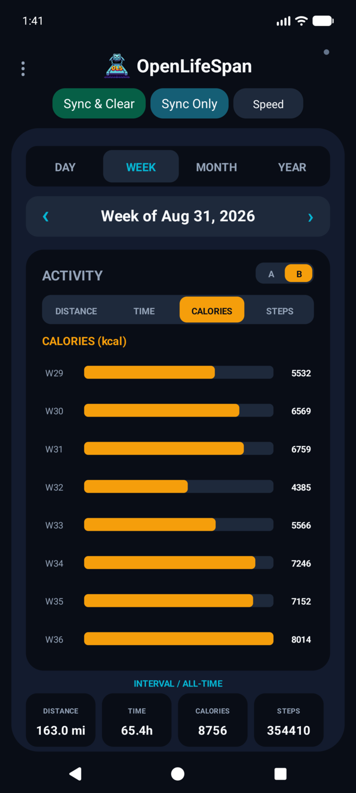
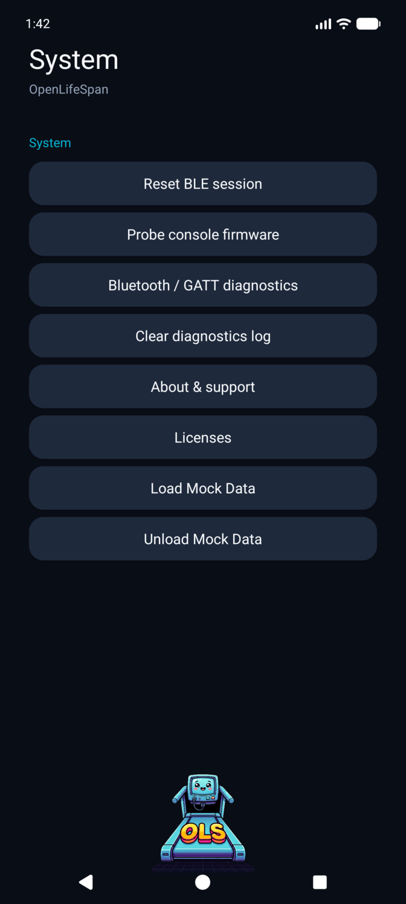

# OpenLifeSpan

OpenLifeSpan is a clean-room, local-first Android companion for compatible LifeSpan treadmills. It reads treadmill activity over Bluetooth Low Energy (BLE), keeps workout history on the phone, and presents it in Day, Week, Month, and Year dashboards—without a LifeSpan account or cloud service.

Created by [MooseAI, LLC](https://mooseaillc.com) · Support: [support@mooseaillc.com](mailto:support@mooseaillc.com)

## What it does

- Connects directly to compatible LifeSpan treadmill consoles over BLE.
- Syncs distance, elapsed time, calories, steps, speed, and units into local session history.
- Provides Day/Week/Month/Year charts, interval versus all-time totals, miles/kilometers, and hours/minutes views.
- Supports two chart layouts, horizontal navigation, calendar-based date selection, and in-app usage guidance.
- Offers a guarded speed-control interface and a separate Sync & Clear flow for console counters.
- Includes GATT diagnostics, firmware probing, bounded rotating logs, and a BLE reset action for troubleshooting.
- Exports readable, versioned JSON backups and CSV. Import validates data before applying it; restore replaces the local database atomically.

The initial hardware target is the LifeSpan TR-1200 DT3 console. Other compatible LifeSpan consoles may work, but have not yet been verified.

## Screenshots

<p align="center">
  
  
</p>

The dashboard offers a compact horizontal analytics view alongside a scrollable multi-metric view. System tools keep Bluetooth diagnostics and recovery actions close at hand.

## Privacy

OpenLifeSpan is local-first:

- No account, cloud sync, analytics SDK, ads, trackers, or social SDKs.
- Workout history and diagnostic logs remain in app-private storage unless you explicitly export them.
- The app communicates only with the treadmill console over Bluetooth.

## Safety

Speed and console-reset actions are intentionally confirmation-gated. Only operate a treadmill while supervising it, with the safety key and manufacturer safeguards in place. OpenLifeSpan is not medical software.

## Install a development build

Requirements: Android Studio with an Android SDK and JDK 17. The app supports Android 8.0 (API 26) and newer.

```bash
git clone https://github.com/chiesennegs/openlifespan.git
cd openlifespan
./gradlew :app:assembleDebug
```

The APK is written to `app/build/outputs/apk/debug/app-debug.apk`. Install it from Android Studio or with `adb install`.

## Data portability

Use **Data → Export backup** for a full JSON backup and **Data → Restore backup** to atomically replace the local history. Use **Import activity** to merge activity: imported sessions replace local sessions whose activity intervals overlap at millisecond precision; non-overlapping sessions are retained.

Backups use UTC ISO 8601 timestamps with millisecond precision. Imports are streamed and constrained to 64 MiB and 100,000 sessions, then validated before local data changes.

## Development notes

This project intentionally treats legacy-app behavior as compatibility research only. It does not copy decompiled source, proprietary assets, branding, or cloud services. Protocol work is documented through clean-room BLE diagnostics and testing.

Contributions are welcome. Please keep changes local-first, avoid adding tracking dependencies, and include a clear description and test/build result with pull requests.

## License and notices

Copyright 2026 MooseAI, LLC. OpenLifeSpan is licensed under the [Apache License, Version 2.0](LICENSE), a permissive license with an explicit patent grant. See [NOTICE](NOTICE) for attribution and third-party-notice information. This release has no bundled third-party runtime dependencies requiring additional notices.
